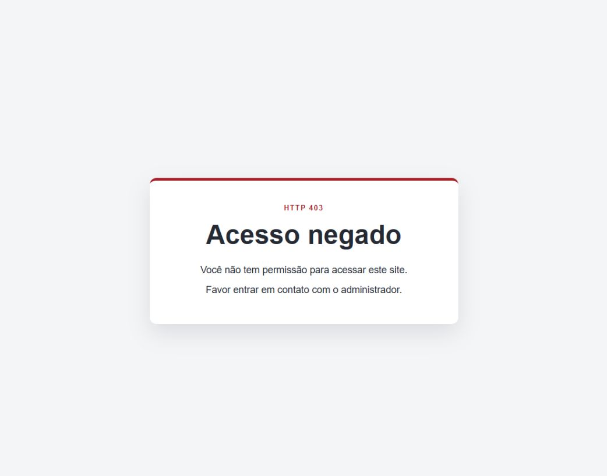

# Atividade — Middleware Laravel

## Objetivo

Esta aplicação demonstra um Controller protegido por uma Middleware. Ao acessar a rota restrita, a Middleware intercepta a requisição antes da ação do Controller e retorna uma View de acesso negado com o status HTTP 403.

O projeto utiliza PHP 8.2 e Laravel 12.69.3. Não utiliza banco de dados, autenticação, API ou bibliotecas de frontend.

## Fluxo

```text
Rota /area-restrita
        ↓
RestrictedAreaController@index
        ↓
CheckPermission
        ↓
access-denied.blade.php
        ↓
HTTP 403 Forbidden
```

O método `index()` possui a View `restricted-area`, mas seu conteúdo não é apresentado porque a Middleware encerra o fluxo antes da execução normal da página protegida.

## Criação da Middleware

Comando utilizado:

```bash
php artisan make:middleware CheckPermission
```

Trecho principal de `app/Http/Middleware/CheckPermission.php`:

```php
public function handle(Request $request, Closure $next): Response
{
    return response()->view('access-denied', [], Response::HTTP_FORBIDDEN);
}
```

A Middleware não chama `$next($request)`. Portanto, a requisição é interrompida e a resposta de acesso negado é enviada imediatamente.

## Controller

O Controller foi criado com:

```bash
php artisan make:controller RestrictedAreaController
```

No Laravel 12, a Middleware foi vinculada diretamente ao Controller por meio da interface `HasMiddleware`:

```php
class RestrictedAreaController extends Controller implements HasMiddleware
{
    public static function middleware(): array
    {
        return [
            CheckPermission::class,
        ];
    }

    public function index(): View
    {
        return view('restricted-area');
    }
}
```

Esse vínculo deixa explícito que todas as ações deste Controller passam pela `CheckPermission`.

## Rota

A rota foi registrada em `routes/web.php` sem lógica de bloqueio:

```php
Route::get('/area-restrita', [RestrictedAreaController::class, 'index']);
```

## Views

- `resources/views/access-denied.blade.php`: View retornada pela Middleware.
- `resources/views/restricted-area.blade.php`: conteúdo protegido que não aparece enquanto a Middleware bloquear a requisição.

Mensagem obrigatória exibida:

```text
Você não tem permissão para acessar este site.
Favor entrar em contato com o administrador.
```

## Como executar

Na pasta desta atividade:

```powershell
composer install
Copy-Item .env.example .env
php artisan key:generate
php artisan serve
```

Acessar:

```text
http://127.0.0.1:8000/area-restrita
```

## Resultado da execução da Middleware

A aplicação foi iniciada com `php artisan serve` e a rota foi consultada por uma requisição HTTP local. Resultado real:

```text
HTTP: 403 Forbidden
PRIMEIRA_MENSAGEM: encontrada
SEGUNDA_MENSAGEM: encontrada
CONTEÚDO_DA_ÁREA_RESTRITA: não encontrado

Acesso negado

Você não tem permissão para acessar este site.
Favor entrar em contato com o administrador.
```

Ao acessar `/area-restrita`, a Middleware `CheckPermission` é executada antes do conteúdo protegido. Ela interrompe a requisição e retorna a View `access-denied`; por isso, a View `restricted-area` não é exibida.

## Evidência da execução



A captura acima foi obtida da execução local real em `http://127.0.0.1:8000/area-restrita`.

## Teste automatizado

O teste `tests/Feature/RestrictedAreaMiddlewareTest.php` verifica:

- resposta HTTP 403;
- título `Acesso negado`;
- presença exata das duas mensagens obrigatórias;
- ausência do conteúdo da área restrita.

Comando executado:

```bash
php artisan test
```

Resultado real obtido:

```text
PASS  Tests\Unit\ExampleTest
PASS  Tests\Feature\ExampleTest
PASS  Tests\Feature\RestrictedAreaMiddlewareTest

Tests:    3 passed (7 assertions)
Duration: 0.96s
```

Também foi executado:

```bash
php artisan route:list -v --path=area-restrita
```

Resultado:

```text
GET|HEAD  area-restrita  RestrictedAreaController@index
          ⇂ web
          ⇂ App\Http\Middleware\CheckPermission
```

## Arquivos principais

```text
app/Http/Controllers/RestrictedAreaController.php
app/Http/Middleware/CheckPermission.php
resources/views/access-denied.blade.php
resources/views/restricted-area.blade.php
routes/web.php
tests/Feature/RestrictedAreaMiddlewareTest.php
docs/images/middleware-execucao.png
```
